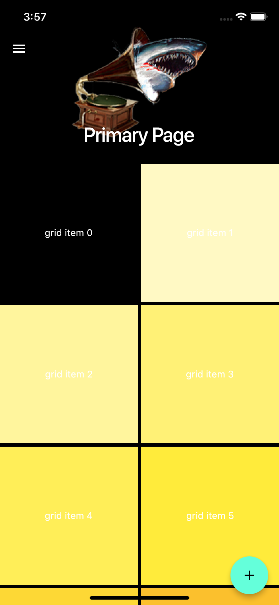
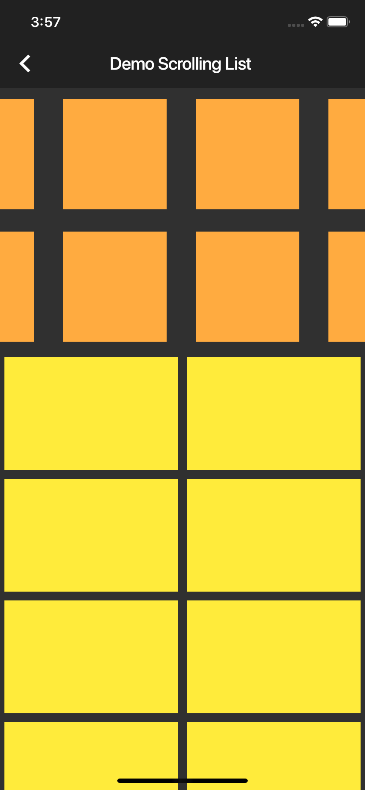

# app (Practice)

A new Flutter project I started to practice some scrolling.
This porject is just me practicing with some new widgets.
Primarily scrolling grids witin a scrolling list 
Will implement these widgets into the music player app
Added Draer option to appbar Widget 
## Started

This project is a starting point for a Flutter application.

A few resources to get you started if this is your first Flutter project:

## Screenshots 

